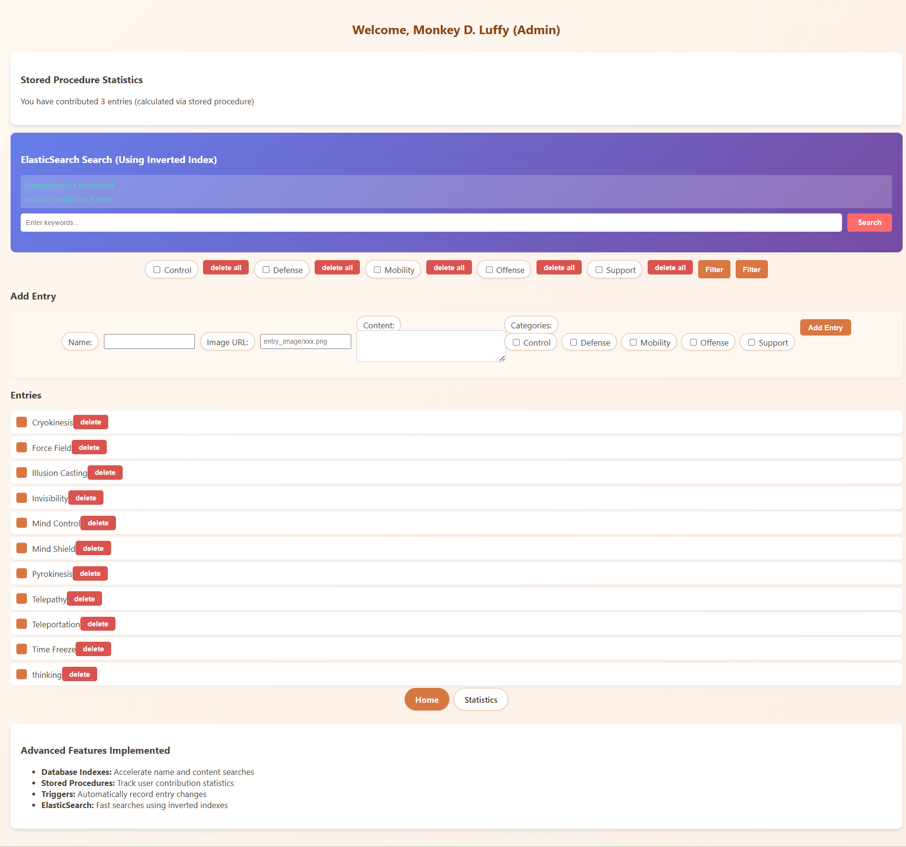

# Fictional Encyclopedia

A **Oracle, PHP-based encyclopedia platform** focusing on **database design, complex SQL queries, and search optimization**. The project implemented CRUD functionality and dynamic ui pages, and emphasizes backend data handling.

---

## **Features & Highlights**

- **Database Design & Optimization**

  - Designed **entity-relationship diagrams** and implemented optimized **Oracle database schema**.
  - Created indexes and optimized table structures to improve query performance.
- **Complex SQL Queries**

  - Engineered advanced SQL queries for data analysis, reporting, and extraction.
  - Optimized joins, aggregations, and filtering for efficient retrieval.
- **Search Functionality with Elasticsearch**

  - Integrated **Elasticsearch** using **Inverted Index** for fast and accurate search.
  - Improved fuzzy keyword search performance by **~40%**.
- **Containerized Deployment**

  - Multi-service app (**PHP + Oracle + Elasticsearch**) containerized using **Docker Compose**.
  - Streamlined local setup and deployment for testing and development.

---

## **Tech Stack**

- **Backend:** PHP
- **Database:** Oracle
- **Search Engine:** Elasticsearch
- **Containerization:** Docker Compose
- **Query Language:** SQL

## **Run Locally**

docker-compose up

http://localhost:8080/login.php

simple log in: role: admin, id: 1, password: luffy123

## **Pages**

